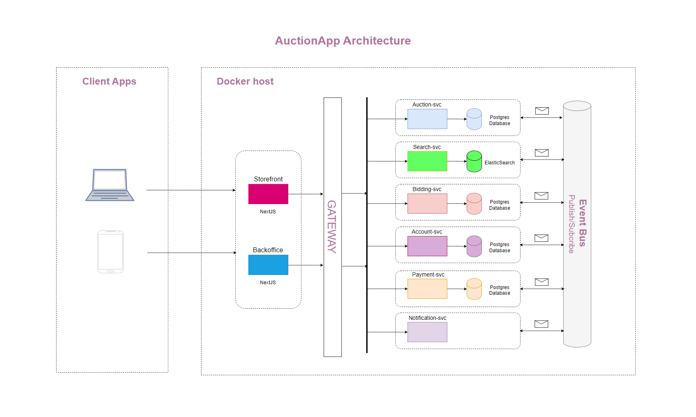

## Technologies used

- Back-end: Asp.net 6, RabbitMq, Signlr
- Front-end: Nextjs 14
- Database: Postgres Sql, Redis
- Software architecture: Microservices + Event-Driven Architecture

## Software architecture

